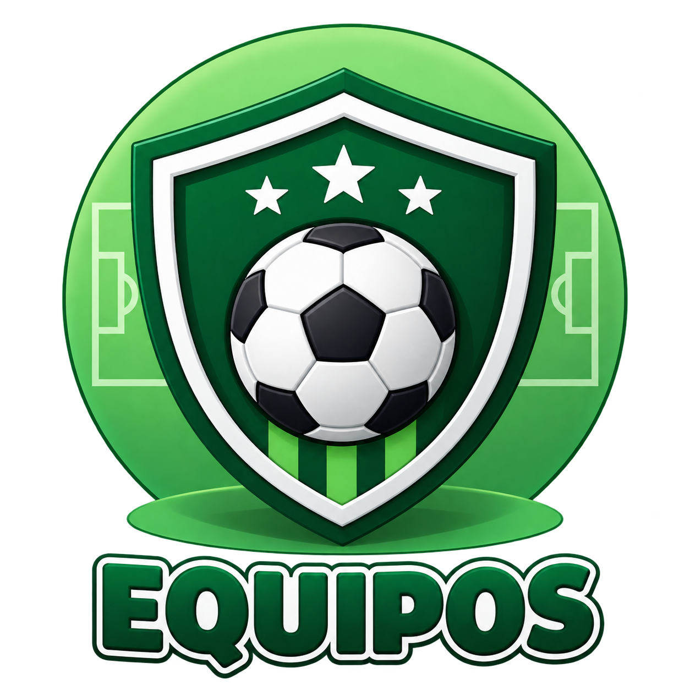

# ⚽ Gestor de Torneos de Fútbol

Sistema web desarrollado para la **gestión y administración de equipos, jugadores y partidos de fútbol**, permitiendo organizar la información de un torneo de manera sencilla y centralizada.

## 📋 Descripción

El **Gestor de Torneos de Fútbol** es un proyecto académico desarrollado con el objetivo de aplicar conocimientos de desarrollo web, programación y organización de proyectos mediante Git y GitHub.

El sistema permite administrar diferentes elementos relacionados con un torneo de fútbol:

- ⚽ Equipos
- 👤 Jugadores
- 📅 Partidos

La aplicación cuenta con diferentes páginas para gestionar cada uno de estos elementos.

## 🎯 Objetivos del proyecto

- Crear una aplicación web para gestionar información de torneos de fútbol.
- Registrar y administrar equipos.
- Registrar y administrar jugadores.
- Asociar jugadores a sus respectivos equipos.
- Registrar y gestionar partidos.
- Aplicar HTML, CSS y JavaScript en un proyecto web.
- Implementar un diseño responsive.
- Utilizar Git y GitHub para organizar el desarrollo.

## 🧩 Funcionalidades principales

### ⚽ Gestión de equipos

Permite:

- Registrar equipos.
- Modificar equipos.
- Eliminar equipos.
- Consultar los equipos registrados.
- Registrar el color de cada equipo.

### 👤 Gestión de jugadores

Permite:

- Registrar jugadores.
- Modificar información de jugadores.
- Eliminar jugadores.
- Asociar jugadores a un equipo.
- Consultar los jugadores registrados.

### 📅 Gestión de partidos

Permite:

- Registrar partidos.
- Seleccionar los equipos participantes.
- Registrar fecha y horario.
- Modificar partidos.
- Eliminar partidos.
- Consultar los partidos registrados.

## 📱 Diseño Responsive

El proyecto utiliza **Bootstrap 5** para adaptar la interfaz a diferentes tamaños de pantalla.

Se implementaron diferentes clases responsive de Bootstrap, por ejemplo:

- `col-12`
- `col-md-*`
- `navbar-expand-lg`
- `table-responsive`
- `img-fluid`

De esta manera, los formularios, tablas, tarjetas, imágenes y menú de navegación se adaptan a dispositivos móviles, tablets y computadoras.

## 🔎 Estrategias SEO implementadas

Se aplicaron diferentes estrategias de **SEO On-Page** para mejorar la estructura y accesibilidad de las páginas.

### Meta etiquetas

Las páginas cuentan con:

- `charset="UTF-8"` para definir correctamente la codificación de caracteres.
- `meta viewport` para adaptar correctamente la página a dispositivos móviles.
- `meta description` con una descripción del contenido de cada página.
- `meta keywords` con palabras relacionadas con el proyecto.
- `meta author` indicando el autor del proyecto.

### Títulos de las páginas

Cada página cuenta con un título específico mediante la etiqueta `<title>`.

Ejemplos:

- `Gestor de Torneos de Fútbol`
- `Equipos - Gestor de Torneos`
- `Jugadores - Gestor de Torneos`
- `Partidos - Gestor de Torneos`

Esto permite identificar correctamente cada página.

### Estructura semántica

Se utilizaron etiquetas HTML semánticas para organizar el contenido:

- `<header>`
- `<nav>`
- `<main>`
- `<section>`
- `<footer>`

Esto permite una estructura más clara y organizada del contenido.

### Texto alternativo en imágenes

Las imágenes incluyen atributos `alt` para proporcionar una descripción del contenido visual.

Ejemplo:

```html

```
